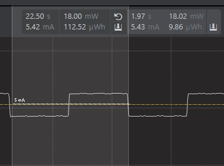

Note: For all assignments and Energy Profiler measurements you’ll be taking this semester,  Peak measurements are instantaneous measurements taken at a specific point in time. In the Energy Profiler, this is accomplished by left-clicking at a location along the time axis.
Average measurements are measurements that are taken over a time-span. In the Energy Profiler, this is accomplished by left-clicking and dragging a region along the time axis.

Please include your answers to the questions below with your submission, entering into the space below each question
See [Mastering Markdown](https://guides.github.com/features/mastering-markdown/) for github markdown formatting if desired.

**1. How much current does the system draw (instantaneous measurement) when a single LED is on with the GPIO pin set to StrongAlternateStrong?**

   Answer: It draws 5.45mA with single LED on with GPIO pin set to StrongAlternateStrong. 
   
   

**2. How much current does the system draw (instantaneous measurement) when a single LED is on with the GPIO pin set to WeakAlternateWeak?**

   Answer: It draws 5.40mA with single LED on with GPIO pin set to WeakAlternateWeak.

   

**3. Is there a meaningful difference in current between the answers for question 1 and 2? Please explain your answer, referencing the main board schematic, WSTK-Main-BRD4001A-A01-schematic.pdf or WSTK-Main-BRD4002A-A06-schematic.pdf, and AEM Accuracy in the ug279-brd4104a-user-guide.pdf. Both of these PDF files are available in the ECEN 5823 Student Public Folder in Google drive at: https://drive.google.com/drive/folders/1ACI8sUKakgpOLzwsGZkns3CQtc7r35bB?usp=sharing . Extra credit is available for this question and depends on your answer.**

   Answer: There is no meaningful difference in the currents between q1 and q2, because the LED consumes less than 1mA (current provided by WeakAlternateWeak). According to ug279-brd4104a-user-guide.pdf, AEM accuracy is 0.1mA for currents above 250uA. Since the difference between Q1 and Q2 are less than 0.1mA, there is no significance between the two values.

**4. With the WeakAlternateWeak drive strength setting, what is the average current for 1 complete on-off cycle for 1 LED with an on-off duty cycle of 50% (approximately 1 sec on, 1 sec off)?**

   Answer: Average current is around 5.17mA with 1 LED on with duty cycle of 50%.

   

**5. With the WeakAlternateWeak drive strength setting, what is the average current for 1 complete on-off cycle for 2 LEDs (both on at the time same and both off at the same time) with an on-off duty cycle of 50% (approximately 1 sec on, 1 sec off)?**

   Answer: Average current is around 5.43mA with 2 LEDs on with duty cycle of 50%.

   

