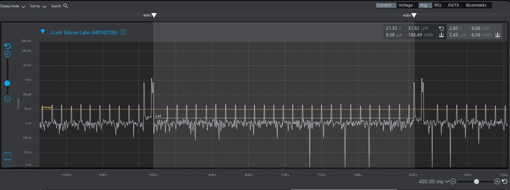

Please include your answers to the questions below with your submission, entering into the space below each question
See [Mastering Markdown](https://guides.github.com/features/mastering-markdown/) for github markdown formatting if desired.

*Be sure to take measurements with logging disabled to ensure your logging logic is not impacting current/time measurements.*

*Please include screenshots of the profiler window detailing each current measurement captured.  See the file Instructions to add screenshots in assignment.docx in the ECEN 5823 Student Public Folder.* 

1. What is the average current per period? (Remember, once you have measured your average current, average current is average current over all time. Average current doesn’t carry with it the units of the timespan over which it was measured).

   Answer: Average current per period is around 10uA.
    Screenshot:  
     

2. What is the ave current from the time we sleep the MCU to EM3 until we power-on the 7021 in response to the LETIMER0 UF IRQ?

   Answer: Average current during EM3 sleep (MCU sleep + SI7021 off) is around 2.43uA.
    Screenshot:  
     

3. What is the ave current from the time we power-on the 7021 until we get the COMP1 IRQ indicating that the 7021's maximum time for conversion (measurement) has expired.

   Answer: Average current from power-on to max-time conversion is around 750uA.
   (excludes 80ms sleep for power-on-sequence, but includes 11ms sleep waiting for conversion. Last EM0 spike is for processing sensor data, so it is not included)
    Screenshot:  
     

4. How long is the Si7021 Powered On for 1 temperature reading?

   Answer: SI7021 is powered on for around 17ms.
    Screenshot:  
     

5. Given the average current per period from Q1, calculate the operating time of the system for a 1000mAh battery? - ignoring battery manufacturers, efficiencies and battery derating - just a first-order calculation.

   Average current = 10uA;  battery_size/average_current =  (1000mA * hour) / (10uA) = (1000000uA * hour) / (10uA) = 100000 hours
   
   Answer (in hours): 100,000 hours
   
6. How has the power consumption performance of your design changed since the previous assignment?   

   Answer: The power consumption performance has gotten much lower, since it is sleeping much more frequently.
   It spends much less time in EM0 so power savings is very significant (especially with the 80ms power-on-reset not in EM0 anymore)
   Also my current usage during EM0 for assignment 3 is very high in comparison (likely due to inefficient EM mechanism + logging). I have modified implementation for Assignment 3 before working on this assignment as well.
