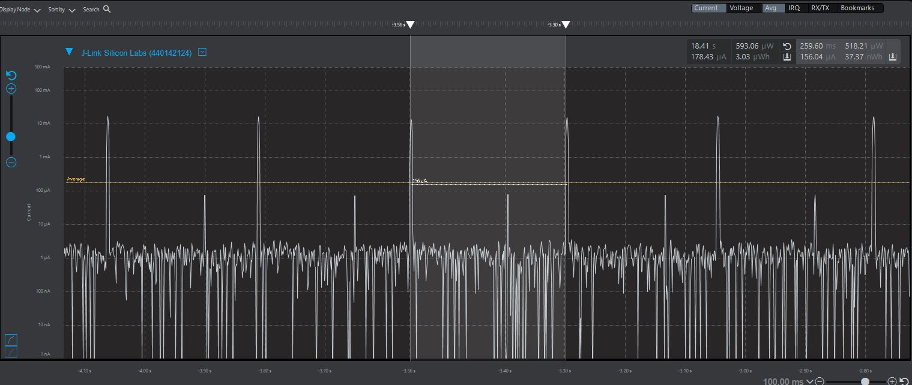
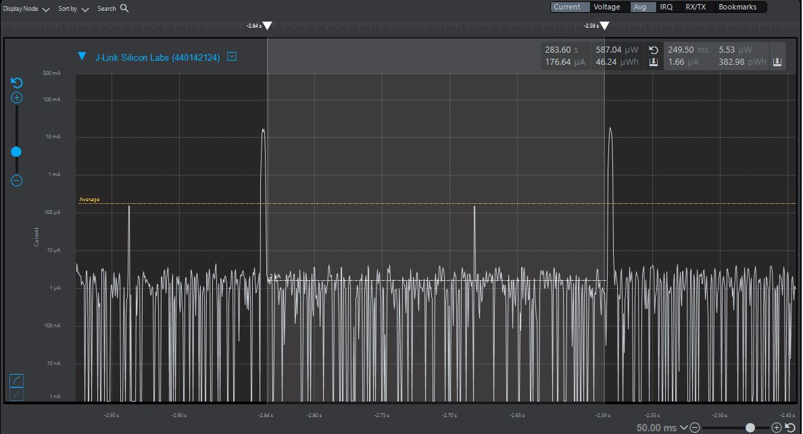
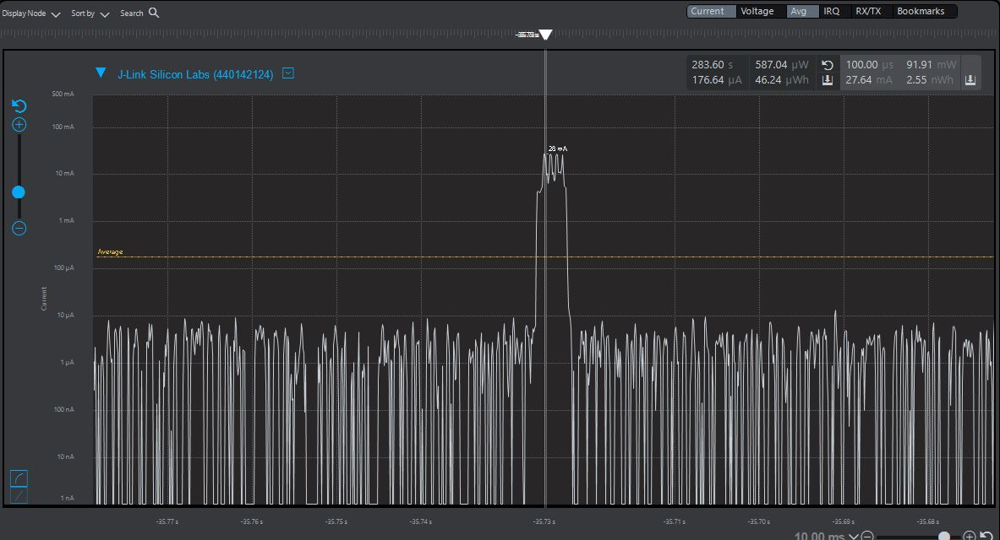
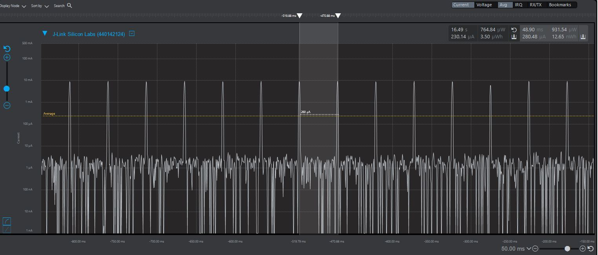
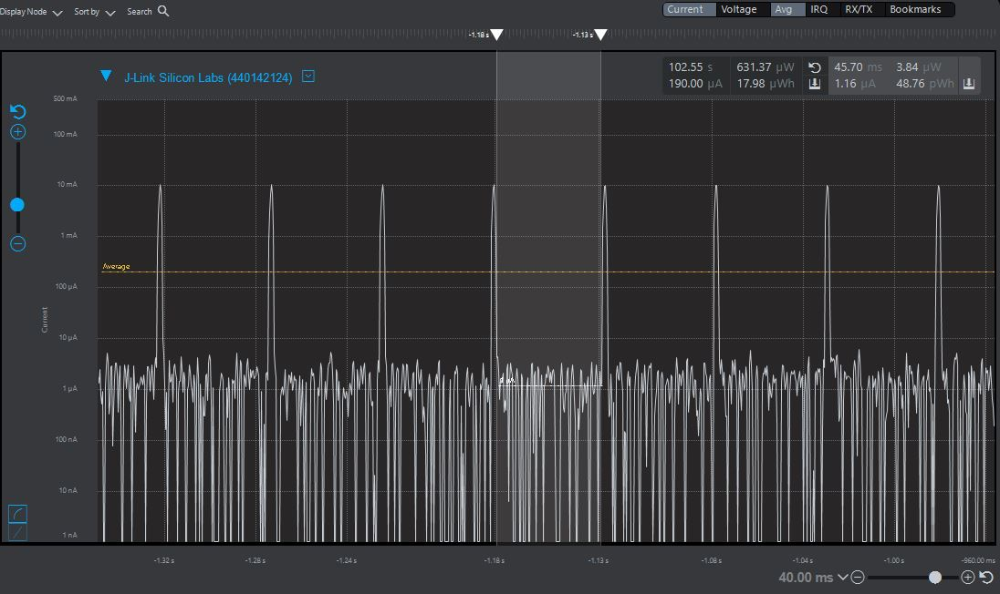
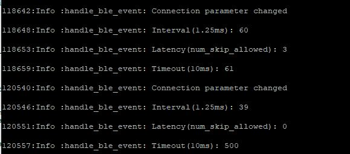

Please include your answers to the questions below with your submission, entering into the space below each question
See [Mastering Markdown](https://guides.github.com/features/mastering-markdown/) for github markdown formatting if desired.

*Be sure to take measurements with logging disabled to ensure your logging logic is not impacting current/time measurements.*

*Please include screenshots of the profiler window detailing each current measurement captured.  See the file Instructions to add screenshots in assignment.docx in the ECEN 5823 Student Public Folder.*

1. Provide screen shot verifying the Advertising period matches the values required for the assignment.

   Answer: Advertising period is around 260ms. This matches the advertising interval of 250ms, and the random advertising delay (which is included in the period)

    Screenshot:  
     

2. What is the average current between advertisements - i.e. when the MCU is sleeping in EM2. (Don't measure an interval with a LETIMER UF event)?
   
   Answer: Average current between advertisements is 1.66uA
    Screenshot:  
     

3. What is the peak current of an advertisement? 
   
   Answer: peak current of advertisement is around 27.6mA (short peaks)
    Screenshot:  
     

4. Provide screen shot showing the connection interval setting. Does the connection interval match the values you requested in your slave(server) code, or the master's(client) values?.
    Screenshot: Connection interval is around 49ms. This matches the master's (I am using balanced priority, which uses 30-100ms parameter)
     

5. What is the average current between connection intervals - i.e. when the MCU is sleeping in EM2. (Don't measure an interval with a LETIMER UF event)?
   
   Answer: average current between intervals is around 1.16uA

    Screenshot:  
     

6. If possible, provide screen shot verifying the slave latency matches what was reported when you logged the values from event = gecko_evt_le_connection_parameters_id. 

   Answer: slave latency does not match sl_bt_connection_set_parameters(), since the client(phone) can reject connection parameter. It is initialized with values (bt_conn_open.connection, 60 (75ms), 60 (75ms), 3, 61, 0x0, 0xffff), where 3 is latency (3 cycles), and 61 is timeout (610 ms). This is ignored by the client.

    Screenshot Connection Log with parameters during sl_bt_evt_connection_parameters_id bluetooth event. Client attempts to change the event parameters to requested one, but eventually changes the parameters to (39 (50ms), 0 (latency), 500 (5000ms timeout)), which matches the client's connection interval.

     

